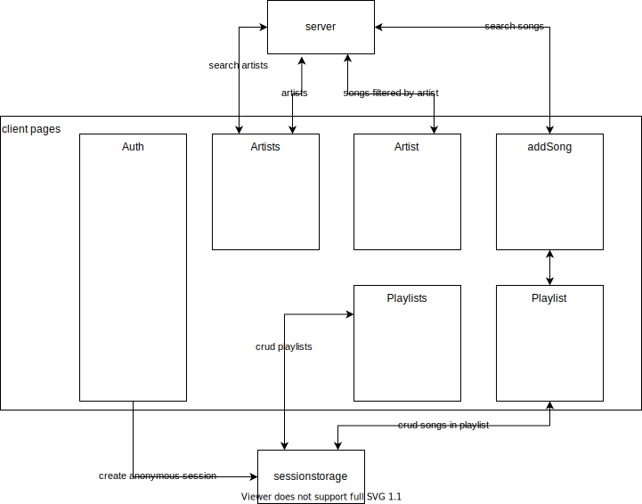

### Intro

This project contains a decoupled client and server app. The client app is generated with @ionic/cli, the server is based on json-server.

The client fetches data (songs, artists) from the server and displays these in lists. A user can create a local session in which his playlists are stored untill the session is ended.

### How to run

Node 10.3+

`npm i`
`npm start`

Above commands will install all dependencies and run the server and client concurrently.

### Architecture

### Case requirements

#### Basic
| item | status |
|---|---|
| app must adhere to corp style  |   |
| user can view list of artists |  |
| user can search artists |  |
| user can see detail page of artis |  |
| user can create and delete playlists |  |
| user can add and remove songs to/from playlist |  |
| user can view playlists |  |
| user can view playlist |  |

#### Extra
| item | status |
|---|---|
| unit & integration tests |   |
| e2e tests |   |
| responsive | :heavy_check_mark: |
| catch unknown routes | :heavy_check_mark:  |
| use a grid system  |   |
| pagination  |   |
| backend error handling  |   |
| local caching  |   |
| button animation  |   |
| use design patterns  |   |
| auth |  local session |
| spotify web api |   |

#### Extra+
| item | status |
|---|---|
| typescript | :heavy_check_mark:  |
| code formatting | :heavy_check_mark:  |
| ... |   |

### Data
https://www.teamrockstars.nl/sites/default/files/db.json

### Styleguide
https://www.teamrockstars.nl/sites/default/files/RST-073-logo-Team-Rockstars-IT.png
https://www.teamrockstars.nl/sites/default/files/styleguide_1%20interactive%20elements.png
https://www.teamrockstars.nl/sites/default/files/styleguide_1%20static%20elements.png

